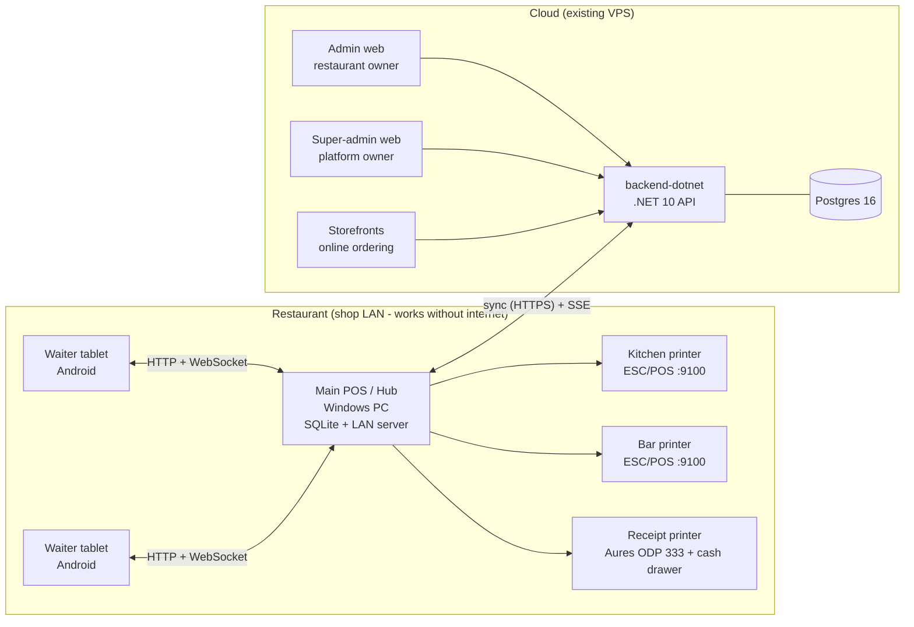
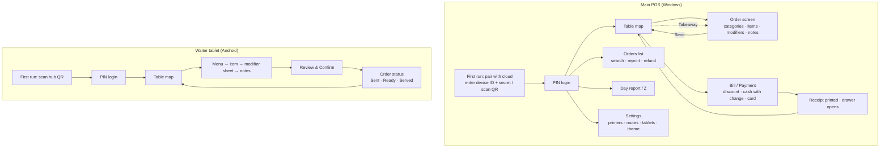

# Restaurant POS: Design Pack

Status: **approved by client** · 2026-10-02
Scope: spec sections 24 (required workflow) and 25 (deliverables 1–25).

The POS is built **on the existing live platform**: the .NET 10 / Postgres backend, the
admin and super-admin web apps, and the VPS deployment. Port Tennant Tandoori and
Star Spice run on that platform today. The POS is sold as a service, and the platform owner
switches each feature on or off per restaurant.

---

## 1. Overview

| Component | Tech | Lives in |
|---|---|---|
| Main POS (hub) | Flutter (Windows), drift/SQLite, shelf HTTP and WebSocket server | `restaurant-pos/` |
| Waiter tablet | The same Flutter app in "Waiter" mode, on Android | `restaurant-pos/` |
| Cloud API | ASP.NET Core (.NET 10), EF Core, Postgres 16 | `backend-dotnet/` |
| Restaurant admin panel | React + shadcn | `admin-frontend/` |
| Platform (super) admin | React + shadcn | `superadmin-frontend/` |
| Online-order terminal (existing) | Flutter, Sunmi V2 | `android/` (unchanged) |

---

## 2. Backward compatibility (hard rule)

Two restaurants are live. **Nothing they use today may change behaviour.**

- **Migrations only add.**
  - New tables, and nullable columns or columns with defaults. Nothing is renamed or dropped.
  - Enums are stored as integers, so new values are **appended at the end** only (for example `StaffRole.Waiter = 4`).
- **Existing endpoints are frozen.**
  - Public checkout, admin menu, orders, tables and devices, auth, and SSE keep their routes, request shapes and response shapes.
  - New behaviour lives only on new routes (`/api/pos/*` and new `/api/admin/*` and `/api/platform/*` routes).
- **`Restaurant.PosEnabled` stays.**
  - The new feature system treats it as the `pos` key.
  - `GET /api/admin/restaurant` → `posEnabled` and `PUT /api/platform/tenants/{id}/features` → `{posEnabled}` keep their shape; the full feature map is an *extra* field.
  - So the Sunmi app, `usePosEnabled.tsx` and today's super-admin switch keep working.
- **Roles.**
  - Existing Owner, Manager and Staff accounts keep full access to the existing admin routes.
  - The new `Waiter` and `Cashier` roles are blocked from the admin panel. They only use the POS.
- **Subscriptions.**
  - An organisation **with no subscription row is treated as active**, so the expiry job can't lock the live restaurants.
  - They are put on a plan only when the platform owner chooses to.
- **New SSE event types are additive.** Existing clients ignore types they don't know.
- **The global exception handler** only wraps *unhandled* 500 errors (which have no body today) in the `ApiResponse` envelope. Every handled response is untouched.
- **New features default to off.** Rollout goes `feature/*` → `uat` (UAT stack) → `main` → `deploy`.
- **Guard tests in CI:**
  - "web checkout still creates an order"
  - "`posEnabled` contract unchanged"
  - "Owner/Manager/Staff can still call the admin routes"
  - "an org without a subscription is active"

---

## 3. Technical architecture

### 3.1 Cloud (existing, extended)
- **Source of truth for:** tenants, menu, staff, tables, printers configuration, devices, features, subscriptions, and the **full order and payment history and reports**.
- **Reused as is:**
  - shared-schema multi-tenancy (`RestaurantId` with a global query filter)
  - JWT token types (staff, customer, device, platform)
  - device pairing and `DeviceValidationMiddleware` (instant revocation)
  - SSE `/api/events/orders`
  - configurable order and payment statuses
  - the `ApiResponse<T>` envelope
- **New:**
  - the `/api/pos/*` area (device token plus the `pos` feature)
  - `[RequireFeature("key")]`, a generalised `[RequirePosEnabled]`
  - `SubscriptionExpiryService` (a `BackgroundService` that runs daily)
  - global exception middleware

### 3.2 Main POS = shop hub (Windows)
- **Local database:** SQLite through drift. It mirrors the menu, modifiers, staff (with PIN hashes), tables, printers, features and licence, plus all **open orders** and an **outbox**.
- **LAN server:** shelf on port 8787 (`/lan/*` for HTTP, `/lan/events` for WebSocket). The Windows installer adds the firewall rule.
- **Printing:** ESC/POS over TCP 9100 to the kitchen and bar printers. The receipt goes to the local or USB Aures. It reuses `restaurant-pos/lib/printing/receipt_builder.dart` (42 columns, CP437) and the simulator in `restaurant-pos/test/escpos_printer_simulator.dart`.
- **Sync with the cloud:**
  - **Down:** `GET /api/pos/config-snapshot` on pairing, then `GET /api/pos/changes?since=` every 60 seconds and when the SSE connection reconnects.
  - **Up:** the outbox posts orders, payments and refunds to `POST /api/pos/orders/sync`. Every record has a **client-generated GUID**, so a retry is an idempotent upsert, never a duplicate.
  - **Online orders:** the hub also listens to cloud SSE, so web orders can print in the kitchen too (behind the feature `pos.printOnlineOrders`).
- **What happens when the internet goes down:** everything in the shop keeps working (tablets, kitchen and bar, payment, receipts and the day report). The outbox drains once the connection is back.
- **What it replaces:** today's Firebase RTDB and SharedPreferences storage. The current shop starts fresh as a new tenant; its old Firebase data is kept read-only and not migrated.

### 3.3 Waiter tablet (Android)
- It is the same Flutter codebase. The mode is chosen at pairing.
- It talks **only to the hub over the LAN**, never directly to the cloud.
- **Pairing:**
  1. The hub shows a QR code with `{hubIp, port, oneTimeKey}`.
  2. The tablet calls `POST /lan/pair` and gets a hub-issued device key.
  3. The hub registers it in the cloud as a `Device` with `DeviceType = WaiterTablet`, so it shows up in device management and counts against the plan's device limit.
- **Security:** plain HTTP on the shop LAN with per-device bearer keys. Add TLS or mDNS discovery if a site needs it. Advice for the shop: give the hub a fixed IP (a DHCP reservation).

### 3.4 Licensing (works offline)
- The cloud issues a **signed licence**: `{restaurantId, features[], subscriptionEnd, graceDays, issuedAt}`, signed with HMAC or Ed25519 by the API.
- The hub refreshes it on every sync and **checks the signature locally**.
- **Reaching the hard lock:**
  1. Once `subscriptionEnd` passes, the hub shows a warning banner.
  2. When `subscriptionEnd + graceDays` passes, new orders are blocked. Open orders can still be paid and printed, and reports stay readable.
- So a subscription still expires on time when the shop is offline.

---

## 4. Database structure

### 4.1 Existing tables (reused, unchanged unless listed in 4.2)
All of them inherit `Entity`: `Id (Guid)`, `CreatedAt`, `UpdatedAt`, `CreatedBy`, `UpdatedBy` and `IsDeleted`. Tenant tables also carry `RestaurantId`.

| Table | Key fields | Used for |
|---|---|---|
| Organization | Name, BillingEmail, IsActive | Billing owner; has subscriptions |
| Restaurant (the tenant) | Name, Slug, address, TimeZone, Currency, IsActive, **PosEnabled**, Supports*, *Minutes | Tenant, receipt header |
| RestaurantStaff | UserId, Role (`StaffRole`), IsActive | Staff membership |
| AppUser (Identity) | Email, FullName, IsPlatformSuperAdmin | Logins |
| Device | DeviceName, DeviceSecretHash, LastSeenAt, IsActive | Paired devices |
| MenuCategory / MenuItem | Name, DisplayOrder, IsActive / BasePrice, IsAvailable, allergens | Product and category management |
| ModifierGroup / ModifierOption / MenuItemModifierGroup | Min/MaxSelect, IsRequired, GroupType / PriceDelta | Modifiers |
| Table | TableNumber, Capacity, Location, QrToken, IsActive | Table management |
| Order | OrderNumber, OrderType, TableId, Subtotal, DiscountAmount, TotalAmount, PaymentMethod, PaymentStatus, Status, **Source (Web/Pos/Kiosk)** | Orders |
| OrderItem / OrderItemModifier | NameSnapshot, UnitPriceSnapshot, Quantity, SpecialInstructions, LineTotal | Lines and modifiers (snapshots) |
| OrderStatusHistory | Status, ChangedByUserId, Note, Timestamp | Audit of status changes |
| Payment | Provider, Amount, Currency, Status | Payments |
| OrderStatusDefinition / PaymentStatusDefinition | per-restaurant configurable lists | Statuses |
| Plan | Name, PriceMonthly, MaxRestaurants, MaxStaffUsers, FeatureFlagsJson | Plans (exists, unused today) |
| Subscription | OrganizationId, PlanId, Status, CurrentPeriodEnd, TrialEndsAt | Subscriptions (exists, unused today) |
| Voucher | Percentage/FixedAmount, validity | Online discounts (unchanged) |

### 4.2 Changes (additive only)

**New tables**

| Table | Columns | Notes |
|---|---|---|
| RestaurantFeature | RestaurantId, Key (string), IsEnabled | One row per toggled feature; unique on (RestaurantId, Key). If there's no row, the plan's default applies, and otherwise the feature is off. Key `pos` keeps reading from `Restaurant.PosEnabled`. |
| SubscriptionPayment | SubscriptionId, Amount, PaidAt, PeriodFrom, PeriodTo, Method, Note, RecordedByUserId | Manual renewals recorded by the super-admin |
| Printer | RestaurantId, Name, Role (Receipt/Kitchen/Bar), Connection (Network/Usb/Windows), Address, Port (default 9100), Columns (default 42), HubDeviceId, IsActive | Configured on the hub and backed up to the cloud |
| Refund | RestaurantId, OrderId, Amount, Method (Cash/Card), Reason, ItemsJson, RefundedByUserId, ApprovedByUserId | Full or partial refunds |

**New columns** (all nullable or with defaults)

| Table | Column | Default | Purpose |
|---|---|---|---|
| RestaurantStaff | PinHash | null | 4–6 digit POS PIN (hashed) |
| Device | DeviceType (`SunmiTerminal=0, MainPos=1, WaiterTablet=2`) | `SunmiTerminal` | Existing rows are unchanged |
| Device | AppVersion, LastIp, HubDeviceId | null | Device management |
| MenuCategory | PrintRoute (`None=0, Kitchen=1, Bar=2`) | Kitchen | Where its items print |
| MenuItem | PrintRouteOverride | null | Per-item exception (for example a dessert wine routed to the bar) |
| Order | GuestCount, WaiterUserId, ClosedAt, DiscountReason, DiscountApprovedByUserId, ClientId (Guid, unique per restaurant) | null | Dine-in details; `ClientId` makes sync idempotent |
| OrderItem | ItemStatus (`Pending=0, Sent=1, Ready=2, Served=3, Void=4`), SentAt, VoidReason | `Pending`; web orders never read it | Kitchen and bar progress per line |
| Subscription | GraceDays | 7 | Grace period before the hard lock |

**Enum values appended**
- `StaffRole`: `Waiter = 4`, `Cashier = 5`
- `PaymentProvider`: `Card = 2` (card terminal, entered by hand)
- `SubscriptionStatus`: `Expired = 4`

**Order totals (POS):**
- `Subtotal` = Σ `LineTotal`, where `LineTotal = (UnitPrice + Σ modifier deltas) × Quantity`
- `TotalAmount` = `Subtotal − DiscountAmount`
- Refunds never edit the order. They are separate `Refund` rows, and reports subtract them.

### 4.3 Feature keys
| Key | Turns on |
|---|---|
| `pos` | Main POS (same as today's `PosEnabled`) |
| `pos.waiter` | Waiter tablets |
| `pos.kitchenPrint` / `pos.barPrint` | Kitchen and bar ticket routing |
| `pos.discounts` / `pos.refunds` | Discounts and refunds at the POS |
| `pos.reports` | Day and range reports |
| `pos.printOnlineOrders` | Web orders print in the kitchen |
| `online.ordering` | Storefront ordering (reserved; today's behaviour is unchanged) |

The keys are a constant list in code, so the super-admin UI renders one switch per key, with no further changes needed.

### 4.4 Hub local database (drift, SQLite)
- Same shapes as the cloud for: menu, modifiers, tables, staff (Id, name, role, PinHash), printers, features and licence.
- Open orders, items and payments use the cloud column names, plus `syncState` (`pending`/`synced`).
- `outbox(id, entityType, entityId, payloadJson, attempts, lastError, createdAt)`.
- `print_jobs(id, printerId, bytes, status, attempts, lastError)`, so a failed print is retried and never lost.

---

## 5. API structure

The JSON envelope is the same everywhere: `{ success, statusCode, message, data }`. On an error, `message` is human-readable and a new `errorCode` field (for example `SUBSCRIPTION_EXPIRED`, `FEATURE_DISABLED`, `FORBIDDEN_ROLE`) lets clients react.

### 5.1 Existing endpoints the POS reuses (unchanged)
- **Auth:** `POST /api/auth/device/login`, `POST /api/auth/staff/login`, `POST /api/auth/refresh`, `GET /api/auth/me`
- **Admin:** `/api/admin/menu-categories`, `/api/admin/menu-items`, modifier groups, `/api/admin/tables`, `/api/admin/devices`, `/api/admin/orders` (list, stats, status), `/api/admin/restaurant`
- **SSE:** `GET /api/events/orders`

### 5.2 New: `/api/pos/*` (device token, `MainPos` device, feature `pos`)
| Method | Route | Purpose |
|---|---|---|
| GET | `/api/pos/config-snapshot` | Full menu, modifiers, tables, staff (with PIN hashes), printers, features, statuses and licence |
| GET | `/api/pos/changes?since={ts}` | Delta of everything above since the timestamp (uses `UpdatedAt`, including soft deletes) |
| POST | `/api/pos/orders/sync` | Batch upsert of orders, items, payments and refunds keyed by `ClientId`. Returns per-record results |
| POST | `/api/pos/devices/tablets` | Register a tablet paired with this hub (checks the device limit) |
| DELETE | `/api/pos/devices/tablets/{id}` | Unpair a tablet |
| GET | `/api/pos/licence` | Signed licence |
| PUT | `/api/pos/printers` | Back up the hub's printer configuration |

### 5.3 New: `/api/admin/*` (staff token; Owner or Manager)
| Method | Route | Purpose |
|---|---|---|
| GET/POST/PUT/DELETE | `/api/admin/staff` | Staff CRUD: name, email, role, active |
| POST | `/api/admin/staff/{id}/pin` | Set or reset a POS PIN |
| GET/PUT | `/api/admin/printers` | View and edit printers and routes |
| PUT | `/api/admin/menu-categories/{id}/print-route` | Category route (a new route; the existing PUT is unchanged) |
| GET | `/api/admin/reports/daily?date=` | Sales by method, by category, by item; discounts; refunds; net |
| GET | `/api/admin/reports/range?from=&to=` | Same figures over a range |
| GET/POST | `/api/admin/orders/{id}/refunds` | List and create refunds (feature `pos.refunds`) |
| GET | `/api/admin/features` | Read-only view of the restaurant's own features |

### 5.4 New: `/api/platform/*` (platform super-admin)
| Method | Route | Purpose |
|---|---|---|
| GET/PUT | `/api/platform/tenants/{id}/feature-map` | All feature keys as a map (the existing `/features` stays for `posEnabled`) |
| GET/POST/PUT | `/api/platform/plans` | Plans: price, limits, default features |
| GET/PUT | `/api/platform/organizations/{id}/subscription` | Set plan, status, period end and grace days |
| POST | `/api/platform/organizations/{id}/subscription/payments` | Record a manual payment, which extends `CurrentPeriodEnd` |
| GET | `/api/platform/devices?restaurantId=` | All devices across tenants |
| PUT | `/api/platform/devices/{id}/deactivate` | Revoke any device |

### 5.5 New: hub LAN API `/lan/*` (served by the main POS)
| Method | Route | Purpose |
|---|---|---|
| POST | `/lan/pair` | Tablet pairing with a one-time key; returns the device key |
| POST | `/lan/staff/pin-login` | PIN login; returns a short session token |
| GET | `/lan/menu` | Menu and modifiers (with ETag) |
| GET | `/lan/tables` | Tables with live status: free, occupied or bill requested |
| POST | `/lan/orders` | Create an order for a table (items, modifiers, notes) |
| POST | `/lan/orders/{id}/items` | Add items to an open order |
| POST | `/lan/orders/{id}/send` | Send pending items to the kitchen and bar |
| PUT | `/lan/orders/{id}/items/{itemId}/status` | Mark an item Ready or Served (KitchenDisplay or Waiter) |
| POST | `/lan/orders/{id}/items/{itemId}/void` | Void an item (needs a Manager PIN) |
| WS | `/lan/events` | Pushes `order.created`, `item.status`, `table.status` and `order.closed` |

---

## 6. User roles and permissions

| Action | SuperAdmin | Owner | Manager | Cashier | Waiter | KitchenDisplay |
|---|:-:|:-:|:-:|:-:|:-:|:-:|
| Tenants, plans, subscriptions, features | ✅ | – | – | – | – | – |
| Business settings, staff, printers | – | ✅ | ✅ (not Owners) | – | – | – |
| Menu, categories, modifiers, tables | – | ✅ | ✅ | – | – | – |
| Take orders (POS or tablet) | – | ✅ | ✅ | ✅ | ✅ | – |
| Send to kitchen and bar | – | ✅ | ✅ | ✅ | ✅ | – |
| Mark item Ready | – | ✅ | ✅ | – | – | ✅ |
| Mark item Served | – | ✅ | ✅ | ✅ | ✅ | – |
| Void item | – | ✅ | ✅ | PIN approval | PIN approval | – |
| Apply discount | – | ✅ | ✅ | PIN approval | – | – |
| Take payment, print receipt | – | ✅ | ✅ | ✅ | – | – |
| Refund | – | ✅ | ✅ | – | – | – |
| Daily and range reports | – | ✅ | ✅ | Own shift only (day total) | – | – |
| Device pairing and management | ✅ (all) | ✅ | ✅ | – | – | – |

- **PIN approval:** a Manager enters their PIN on the same screen. The approving user is stored (`DiscountApprovedByUserId`, `Refund.ApprovedByUserId`).
- **Where it's enforced:**
  - Server: ASP.NET authorization policies on every new endpoint, plus a policy that blocks `Waiter` and `Cashier` from the existing admin routes.
  - Hub: the same matrix, in one Dart map.
  - Existing `Staff`-role accounts behave like Manager on the admin routes (as today).

---

## 7. Screen flow

- **Admin web, new pages:** Staff (with PIN reset), Printers and Routes, Reports (daily and range, CSV export), POS Settings (features shown read-only).
- **Super-admin web, new pages:**
  - Tenant → Features (one switch per key)
  - Tenant → Subscription (plan, period end, grace, payment history, "Record payment")
  - Plans
  - Devices
- **Theme:** light, dark or system on both the POS and the tablet (`ThemeMode`), saved per device.

---

## 8. Required workflow (spec section 24), step by step

| # | Step | Where | How |
|---|---|---|---|
| 1 | Waiter tablet | Tablet | PIN login (`/lan/staff/pin-login`) |
| 2 | Select table | Tablet | `/lan/tables`. The table turns *occupied* once an order exists |
| 3 | Select products | Tablet | `/lan/menu`, cached; unavailable items are greyed out |
| 4 | Add modifiers and notes | Tablet | Modifier sheet enforces Min/Max/Required; free-text note per item |
| 5 | Confirm order | Tablet | `POST /lan/orders` (or `/items` to add to an open order), then `/send` |
| 6 | Main POS | Hub | Order saved to SQLite with a new `ClientId`; shows live on the POS table map |
| 7 | Order processing | Hub | Items are split by route (`PrintRouteOverride` ?? the category's `PrintRoute`); `ItemStatus` set to `Sent` |
| 8 | Kitchen and bar printer | Hub | One ticket per printer: table, waiter, time, items, modifiers, notes. Queued in `print_jobs` and retried, with an on-screen alert if a printer is offline |
| 9 | Kitchen prepares | Kitchen | Paper ticket. Optionally KitchenDisplay marks it `Ready` (a KDS screen comes later) |
| 10 | Waiter sees status | Tablet | WebSocket `item.status` updates the status list live |
| 11 | Customer receives food | Tablet | Waiter marks `Served` |
| 12 | Payment | Main POS | Bill → optional discount → Cash (amount tendered, change due) or Card (entered by hand). A `Payment` row; drawer opens on cash (ESC p) |
| 13 | Customer receipt | Main POS | Aures ODP 333 receipt (existing builder, CP437 £) |
| 14 | Order completed | Hub | Status `Completed`, `ClosedAt` set, table *free*; order goes into the outbox |
| 15 | Sales report updated | Hub and cloud | Day report on the hub straight away (local); cloud reports once the outbox syncs (`/api/pos/orders/sync`) |

---

## 9. Error handling

| Layer | Behaviour |
|---|---|
| Cloud API | Global middleware: unhandled exception → logged (Serilog) → `ApiResponse.Fail("Something went wrong", 500)` with a correlation id. Validation → 400 with field messages. Feature off → 403 `FEATURE_DISABLED`. Expired → 402 `SUBSCRIPTION_EXPIRED` |
| Sync | The outbox retries with exponential backoff (up to 5 minutes). A record rejected by the server (4xx) is parked with its error and shown in POS Settings → Sync. It never blocks other records |
| Printing | Failed job → retry ×3 → red banner "Kitchen printer offline – N tickets waiting" with Retry and Reprint. Jobs survive a restart (SQLite) |
| LAN | Tablet shows "Hub unreachable" and retries. Unsent orders stay on the tablet until the hub answers; confirming is safe to repeat because of `ClientId` |
| Hub crash | All state is in SQLite (WAL mode); on restart, open orders and the queued print and outbox jobs carry on |

---

## 10. Backup and recovery

| What | How | Frequency |
|---|---|---|
| Cloud Postgres | Existing `deploy/backup-postgres.sh` (`pg_dump`, 7-day retention) **plus** an rclone copy to off-site object storage (for example Backblaze B2) | Nightly 03:00 |
| Cloud images (MinIO) | `rclone sync` of the bucket to off-site storage | Nightly |
| Hub SQLite | `VACUUM INTO` a dated file in `%APPDATA%`, keeping 14 copies. The cloud also holds every synced order | Nightly and on close |
| Restore drill | Restore the newest dump into the UAT database and check the row counts | Monthly, written checklist |

- **Recovery when the hub PC dies:**
  1. Install the POS on a new PC.
  2. Pair it as `MainPos` (the old device is revoked in admin).
  3. It pulls `config-snapshot` and any open orders from the cloud.
  4. Re-pair the tablets by QR.
- **What's lost:** orders that were never synced before the crash. To keep that small, sync runs every 60 seconds whenever the connection is up.

---

## 11. Testing

| Level | What | Tooling |
|---|---|---|
| Backend unit | Feature resolution (plan default vs override vs `PosEnabled`), subscription expiry and grace, sync idempotency (same `ClientId` twice = one order), refund limits (never more than paid), role policies | xUnit (existing `tests/Platform.Application.Tests`) |
| Backend guards | The backward-compatibility tests in section 2 | xUnit, runs in CI on every branch |
| Hub unit | Print routing, totals and discounts, outbox retry, licence check, permission matrix | `flutter test` |
| Printing | Kitchen, bar and receipt bytes through the existing ODP 333 simulator (flags overflow and unknown commands, renders PNG) | `restaurant-pos/test/escpos_printer_simulator.dart` |
| End-to-end workflow | Section 8 steps 1–15 in one test: fake tablet client → hub LAN server → simulated printers → payment → report → fake cloud sync | `flutter test` (in-process) |
| UAT | Real Windows PC, an Android tablet and network printers on the UAT stack before each release | Manual checklist |

---

## 12. Milestones vs deliverables

| Milestone | Contents |
|---|---|
| **M1** Backend foundation | Features, plans and subscriptions plus expiry job, roles and staff CRUD and PINs, device types, printers and routes, refunds, POS order sync, reports, global errors, guard tests |
| **M2** POS core (hub) | drift DB, pairing and sync, PIN login, table map, order screen, payment (cash/card), discount, refund, receipt, day report, dark/light; Firebase removed |
| **M3** Tablet and kitchen | LAN server, tablet mode, kitchen and bar routing and printing, live status |
| **M4** Admin panels | Admin: Staff, Printers, Reports, POS Settings. Super-admin: Features, Subscription, Plans, Devices |
| **M5** Hardening | Offline soak test, backups off-site, restore drill, end-to-end test, UAT sign-off |

| # | Deliverable | Section | Milestone |
|---|---|---|---|
| 1 | Working Main POS | 3.2, 7 | M2 |
| 2 | Waiter Tablet interface | 3.3, 7 | M3 |
| 3 | Kitchen Printer integration | 3.2, 8 | M3 |
| 4 | Bar Printer integration | 3.2, 8 | M3 |
| 5 | Customer receipt printing | 8 | M2 |
| 6 | Staff login and roles | 6 | M1, M2 |
| 7 | Product/category management | 4.1, 5.1 | existing + M1 (routes) |
| 8 | Table management | 4.1, 5.5 | existing + M2 |
| 9 | Order management | 5.2, 5.5 | M2 |
| 10 | Cash/card payment workflow | 8 | M2 |
| 11 | Discount | 4.2, 6 | M2 |
| 12 | Refund | 4.2, 5.3 | M1, M2 |
| 13 | Daily sales/report | 5.3 | M1, M2 |
| 14 | Dark/Light mode | 7 | M2 |
| 15 | Admin Panel | 7 | existing + M4 |
| 16 | Business/user management | 5.3, 5.4 | M1, M4 |
| 17 | Subscription management | 5.4 | M1, M4 |
| 18 | Automatic subscription expiry | 3.4 | M1 |
| 19 | Subscription renewal | 5.4 | M1, M4 |
| 20 | Device management | 5.2, 5.4 | M1, M4 |
| 21 | Secure multi-tenant database | 2, 3.1 | existing |
| 22 | Offline/sync architecture | 3.2, 3.4 | M2, M3 |
| 23 | Proper error handling | 9 | M1–M3 |
| 24 | Backup/recovery strategy | 10 | M5 |
| 25 | Complete testing | 11 | all |

---

## 13. Open questions for the client
1. **Split bills** (by item or by guest) and **tips**: needed now, or later?
2. **Courses** (starters, then mains, "fire mains" later)?
3. **More than one till** (main POS) per shop? The design assumes one hub per shop.
4. **Kitchen screen (KDS)** instead of or as well as paper tickets?
5. **Kitchen and bar printer models** (any ESC/POS LAN printer works; the model sets the column width).
6. **Takeaway and collection at the POS** as well as dine-in: assumed yes (same order screen, no table).
7. **VAT** shown on the receipt and in reports? (Not modelled yet; prices are treated as VAT-inclusive.)
8. **Plans:** names, prices and which features each one includes.

---

## 14. M1 build notes (2026-10-02)

M1 (backend foundation) is on `feature/pos-m1-backend`. Where it differs from or adds to the sections above:

- **Sync takes closed orders only.** `POST /api/pos/orders/sync` accepts an order only in a completed status and raises no SSE event, so the Sunmi terminal and the admin "active orders" list never see POS orders as new work. Open orders stay on the hub (section 10's "pull open orders from the cloud" is therefore not available yet).
- **`changes?since=` returns `liveIds`.** Some existing admin screens hard-delete menu rows, tables and modifiers, so the hub drops any local row whose id is missing rather than relying on `IsDeleted`.
- **New route `POST /api/admin/pos-devices`** registers a `MainPos` device. `POST /api/admin/devices` keeps creating Sunmi terminals exactly as before.
- **New route `PUT /api/admin/menu-items/{id}/print-route`** sets `PrintRouteOverride`.
- **New column `Plan.MaxDevices`** (null = unlimited). Hubs and tablets count against it; Sunmi terminals don't.
- **Subscription expiry only affects the POS licence.** It never suspends a restaurant or its web ordering.
- **Licence:** ECDSA P-256. The key comes from `PosLicence:PrivateKeyPem`, or is derived from `Jwt:SigningKey` when that's not set (rotating the JWT key then means re-pairing hubs).
- **PIN hashes:** `pbkdf2-sha256$10000$<salt b64>$<hash b64>`, unique per restaurant, so a PIN alone identifies the person at the till.
- **Reports** count an order on `ClosedAt` (POS) or `CreatedAt` (web), by local day in the restaurant's time zone.
- **Roles:** reports and refunds allow Owner, Manager and the existing Staff role. Staff management is Owner/Manager only.

---

## 15. M3 build notes (2026-10-03)

M3 (tablet and kitchen) is on `feature/pos-m3`, branched from `feature/pos-m1-backend`. It changes only the app in `restaurant-pos/`; the backend endpoints it uses already shipped in M1. Where it differs from or adds to the sections above:

- **Kitchen and bar tickets:**
  - *Send* queues one ticket per station, split by route (the item's override, otherwise its category's route).
  - Only stations whose feature is on print: `pos.kitchenPrint`, `pos.barPrint`.
  - Voiding a dish that was already sent prints a **VOID** ticket to its station.
  - Tickets wait in a SQLite `print_jobs` table until their printer answers. The till retries every 15 seconds and shows a red banner with **Retry**.
  - One failing printer never holds up the others.
- **LAN server:**
  - Uses `dart:io` HTTP and WebSocket on port 8787. No `shelf` dependency was needed.
  - Starts only on the main till.
  - The events feed is reduced to two messages, `order.updated` and `order.closed`, each carrying the whole order. Tablets work out table and dish status from those.
- **Pairing a tablet:**
  - The till shows its address and a **6-digit code**. The code works once, for 10 minutes, and dies after 5 wrong tries.
  - The tablet types it in. There is no QR scanning yet, because that needs a camera plugin.
  - Pairing registers the tablet in the cloud (`POST /api/pos/devices/tablets`), so the till must be online to pair one.
- **Tablet security and validation:**
  - Each tablet has a bearer key, plus a staff session from a PIN login that lasts 12 hours.
  - Five wrong PINs lock that tablet out for 30 seconds.
  - Prices and modifier rules always come from the till's menu, never from the tablet. A request with one invalid dish changes nothing.
- **App mode:** the same app runs as till or tablet. Android starts as a tablet, Windows as a till, and an unpaired device can switch on its first screen.
- **Status on the till:**
  - The till's order screen shows each dish as sent, ready or served.
  - The table map shows "n ready".
  - Without a kitchen screen, the till itself can mark a dish Ready or Served.
- **Not in M3:**
  - Printing web orders in the kitchen (`pos.printOnlineOrders`).
  - A kitchen display screen (KDS).
  - The Windows firewall rule for port 8787. Windows asks once on first run; the installer will add the rule in M5.
  - **The Android build**, which is blocked on this machine because the only JDKs are Java 25 and Gradle 8.10 needs ≤ 24. The fix is to install JDK 17/21 or upgrade the Android Gradle setup (M5).
